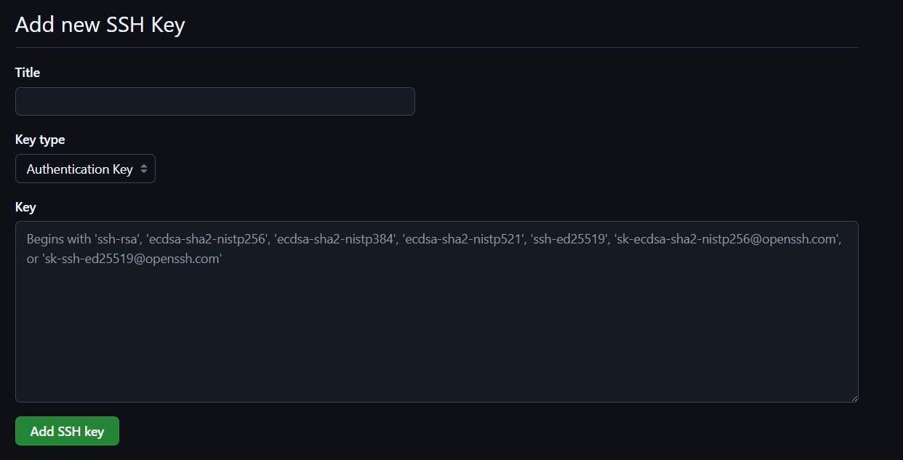

# Set up

## Installations

- Download git from [https://git-scm.com/downloads](https://git-scm.com/downloads)

## Sign up & Login in Github

[GitHub · Build and ship software on a single, collaborative platform](https://github.com/)

- Make your Github Account

## Set up your username & email

- Open cmd on your computer
    - Type `git config --global user.name “your_username”`
    - Type `git config --global user.email “your_email”`

## Set up SSH Keys

This part is optional but it offers more security and you will no longer do authorization again and again after a push/pull

- Generate SSH Keys in your computer from [Github Docs](https://docs.github.com/en/authentication/connecting-to-github-with-ssh/generating-a-new-ssh-key-and-adding-it-to-the-ssh-agent#generating-a-new-ssh-key)
- Open [GitHub Keys](https://github.com/settings/keys)

- Click on the New SSH Key Button

- Give it a Title
- Leave Key Type as Default
- Paste your Public Key
- Hit Add SSH Key

## Find SSH Key

When you generate SSH keys, Two files get generated on your machine, They are most likely to be generated in your Users in C drive

Find the file with pub at the end of it’s name

Open the file in a Text Editor or Notepad and copy its code

<aside>

Do not share those files because they contain your SSH credential

</aside>